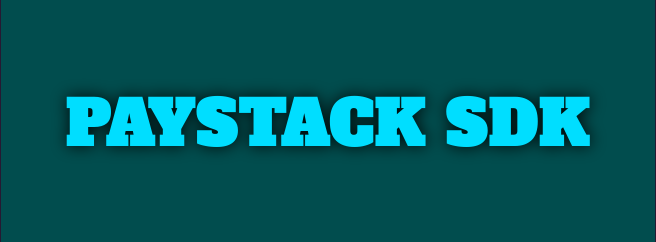

<div align="center">
<svg width="100" height="100" viewBox="0 0 29 28" fill="none"><path fill-rule="evenodd" clip-rule="evenodd" d="M1.51165 0H25.7369C26.5715 0 27.2504 0.671185 27.2504 1.50214V4.16909C27.2504 4.99651 26.5716 5.67141 25.7369 5.67141H1.51165C0.676996 5.67141 0 4.99657 0 4.16909V1.50214C0 0.671185 0.676996 0 1.51165 0ZM1.51165 14.887H25.7369C26.5715 14.887 27.2504 15.5599 27.2504 16.3874V19.058C27.2504 19.8854 26.5716 20.5566 25.7369 20.5566H1.51165C0.676996 20.5566 0 19.8854 0 19.058V16.3874C0 15.5599 0.676996 14.887 1.51165 14.887ZM15.1376 22.3304H1.51165C0.676996 22.3304 0 23.0016 0 23.8309V26.4997C0 27.3272 0.676996 28 1.51165 28H15.1377C15.9759 28 16.6511 27.3272 16.6511 26.4997V23.8309C16.6511 23.0016 15.9759 22.3304 15.1376 22.3304ZM1.51165 7.44171H27.2504C28.0868 7.44171 28.7619 8.11469 28.7619 8.94379V11.6127C28.7619 12.4401 28.0868 13.1148 27.2504 13.1148H1.51165C0.676996 13.1148 0 12.4401 0 11.6127V8.94379C0 8.11469 0.676996 7.44171 1.51165 7.44171Z" fill="#09A5DB"></path></svg>


    <p align="center">
        <a href="https://github.com/MusheAbdulHakim//actions"></a>
        <a href="https://packagist.org/packages/musheabdulhakim/paystack"></a>
        <a href="https://packagist.org/packages/musheabdulhakim/paystack"></a>
        <a href="https://packagist.org/packages/musheabdulhakim/paystack"></a>
    </p>
</div>


------
This package provides a wonderful **PHP** client that allows you to interact
with [Paystack Api](https://paystack.com/docs)

**This SDK** is a PHP & Laravel Package, (Designed to help working with paystack api easier and faster).


## Requirement
> **Requires [Composer](https://getcomposer.org/)**
> **Requires [PHP 8.2+](https://php.net/releases/)**


<a name="Installation"></a>
## Installation

```bash
 composer require musheabdulhakim/paystack
```

## Basic usage

```php

use MusheAbdulHakim\Paystack\Paystack;

$paystack = Paystack::client('your-api-key');

//or 

$paystack = Paystack::client('secret-api-key','https://api.paystack.co');
```

### Example
```php


$customers = $paystack->customer()->list();

$initialize_transaction = $paystack->transaction()->initialize([
    //
]);


```

##### Refer to the documentation [here](https://musheabdulhakim.github.io/Paystack/)

### Configuration

```php

    'PAYSTACK_API_URI' => 'https://api.paystack.co',

    'PAYSTACK_SECRET_KEY' => '',

    'PAYSTACK_PUBLIC_KEY' => '',
```


## Contribution


🧹 Keep a modern codebase with **php-cs-fixer**:

```bash
composer lint
```

🚀 Run the entire test suite:

```bash
composer test
```

Report all your issues [Here](https://github.com/MusheAbdulHakim/Paystack/issues)

All your pull requests are welcome :). 
